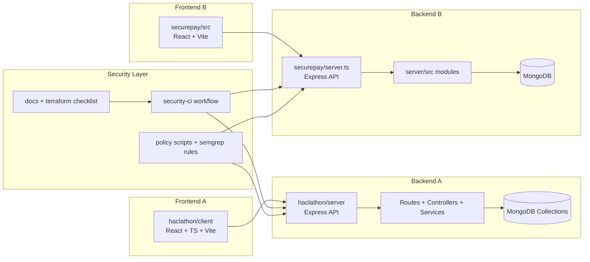

# Secure Pay Workspace

This repository contains two related application implementations and shared security automation.

## Code Summary

### 1) haclathon/
A full secure digital wallet stack:
- `haclathon/server`: Express + MongoDB backend with auth, wallet, fraud, dispute, admin, audit logging, and socket alerts.
- `haclathon/client`: React + TypeScript frontend for wallet operations, fraud reporting, disputes, sessions, and admin tools.

Key backend modules:
- `routes/`: API endpoint mapping (`auth`, `wallet`, `fraud`, `dispute`, `admin`)
- `controllers/`: Request orchestration and business logic
- `services/`: Fraud analysis, audit logging, investigation timeline, session utilities
- `models/`: Mongoose schemas (`User`, `Transaction`, `FraudReport`, `DisputeCase`, `Session`)
- `utils/`: encryption and JWT helpers
- `middleware/`: auth, validation, and rate limiting

### 2) securepay/
A second wallet-style implementation:
- `securepay/server.ts`: Express server bootstrap + Vite integration
- `securepay/server/src`: modular API (`controllers`, `routes`, `middleware`, `models`, `services`, `config`)
- `securepay/src`: frontend application code

### 3) Shared Security and Platform Assets
- `.github/workflows/security-ci.yml`: CI security pipeline (guardrails, Semgrep, Gitleaks, dependency audit)
- `security/policy/`: policy-as-code guardrails for Linux and Windows
- `infra/terraform/security-checklist.md`: IaC implementation checklist for 7-layer defense
- `docs/security/architecture.md`: extended security architecture reference
- `seven-layer-security.sh`: repository security scan script focused on the `haclathon` app

## High-Level Architecture Diagram



## Haclathon Request Flow Diagram

```mermaid
flowchart TD
  C[Client App\nhaclathon/client] --> A[/api/auth/*]
  C --> W[/api/wallet/*]
  C --> F[/api/fraud/*]
  C --> D[/api/dispute/*]
  C --> ADM[/api/admin/*]

  subgraph API[haclathon/server Express API]
    A --> AC[authController]
    W --> WC[walletController]
    F --> FC[fraudController]
    D --> DC[fraudController dispute handlers]
    ADM --> ADC[adminController]

    AC --> AM[authMiddleware + validateRequest]
    WC --> AM
    FC --> AM
    ADC --> AM

    WC --> ENC[utils/encryption + utils/jwtHelper]
    AC --> ENC
    FC --> AUD[auditLogger]
    WC --> AUD
    AC --> AUD
    ADC --> AUD

    FC --> INV[investigationService]
    WC --> AUTO[autoFraudScanner]
    AC --> SES[sessionService]
  end

  ENC --> DB[(MongoDB)]
  AUD --> DB
  INV --> DB
  AUTO --> DB
  SES --> DB
  AC --> DB
  WC --> DB
  FC --> DB
  ADC --> DB

  FC --> IO[Socket.IO alerts]
  ADC --> IO
  IO --> C
```

## Quick Start

- For the primary secure wallet app: see `haclathon/README.md`
- For the alternate app: see `securepay/README.md`
